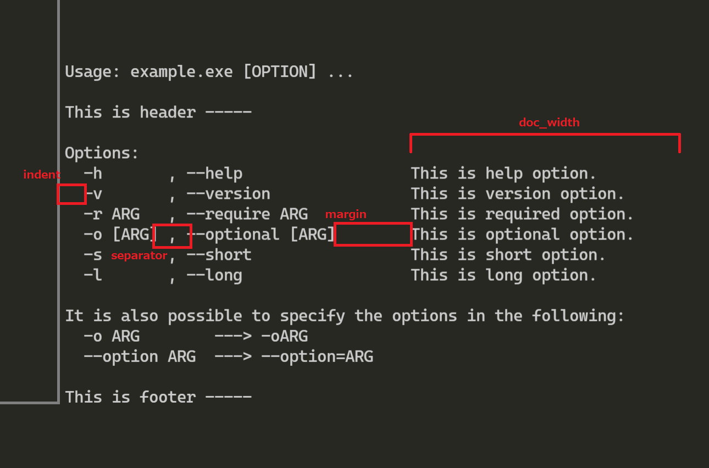
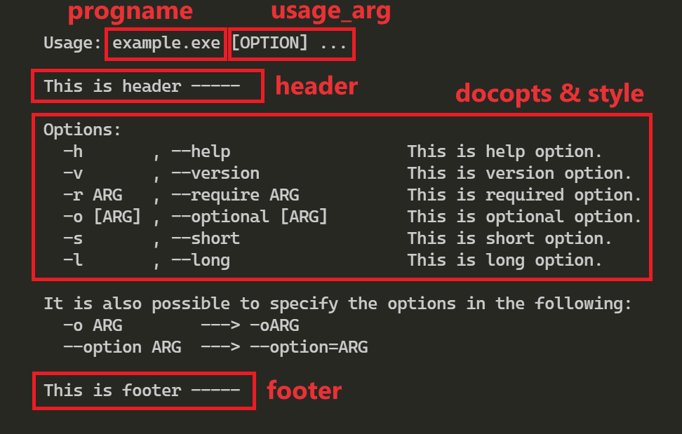

# リファレンス - getopt_flex()

*English version is [here](https://github.com/GrapeJuicer/optarg/blob/main/ref/ref_en_getopt_flex.md).*

こちらは，'getopt_flex()' 関数とそれに関連する要素のリファレンスになります．

# 概要

`getopt_flex()` は，`main` 関数の引数からオプションを解析する関数です．

これは，`getopt.h` の `getopt_long()` 関数のラッパー関数です．
この関数は，本質的には `getopt_once()` と変わりませんが，オプションの情報を保持する構造体が異なります．
`getopt_flex()`では，ここで使用する構造体はstruct docoptionです．

`getopt_flex()` と `getopt_once()` の違いは次の通りです．

- 同一の構造体で長短両方のオプションを保持することが可能
- フラグに値を格納する機能を削除
- `getopt_flex()` で使用する構造体配列が使用可能な `printHelp()`

# リファレンス

- `struct docoption`

    `struct option` は、定義するオプションのリストを格納するための構造体です．
    この構造体では1つのオプションの情報しか格納できないため，通常は配列として宣言する必要があります．

    `struct docoption` は以下のように定義されています．

    ```c
    struct docoption
    {
        const int    val;        // 識別子 = ID
        const int    short_name; // オプション(短)
        const char * long_name;  // オプション(長)
        const int    has_arg;    // 引数を持つかどうか: no_argument, required_argument, optional_argument
        const char * help_msg;   // オプションの概要. 'printHelp()' で使用されます．
    };
    ```

- `struct optarg`

    `struct optarg` は， `getopt_flex()` 関数で解析された結果を格納するための構造体です．
    この構造体では1つの結果の情報しか格納できないため，通常は配列として宣言する必要があります．
    **この配列の大きさは、オプションの数以上である必要があります．**

    `struct optarg` は以下のように定義されています．

    ```c
    struct optarg
    {
        int opt;   // オプションの値
        char *arg; // オプションの引数
    };
    ```

- `struct docstyle`

    `struct docstyle` は，`printHelp()` でヘルプを表示する際に使用する構造体です．

    `struct docstyle` は以下のように定義されています．

    ```c
    struct docstyle
    {
        const char * indent;    // default: "  "
        const char * separator; // default: " , "
        const char * margin;    // default: "        "
        int          doc_width; // default: 40
    };
    ```

    デフォルトのスタイル `DEFAULT_STYLE` は以下のように定義されています．

    ```c
    #define DEFAULT_STYLE (struct docstyle){ .indent = "  ", .separator = " , ", .margin = "        ", .doc_width = 40 }
    ```

    各メンバと表示されるヘルプの関係は次の通りとなります．

    


- `getopt_flex(int argc, char **argv, const struct docoption *docopts, struct optarg *findopts, size_t findopts_size)`

    `getopt_flex()` は，`main` 関数の引数からオプションを解析する関数です．

    `getopt_flex()` は以下のように定義されています．

    ```c
    // 戻り値: 見つかったオプションの数
    int getopt_flex(
        int argc,                        // main 関数の argc
        char **argv,                     // main 関数の argv
        const struct docoption *docopts, // オプションのリスト
        struct optarg *findopts,         // 見つかったオプションの情報
        size_t findopts_size             // findopts の配列の大きさ
    );
    ```

- `printHelp(const struct docoption *docopts, const char *progname, const char *usage_arg, const struct docstyle style, const char *header, const char *footer)`

    `struct docoption` 構造体に格納されたオプションの情報をもとに，ヘルプを生成して表示します．

  - `docopts` : オプションの内容を格納した `struct docoption` 型配列
  - `progname` : プログラム名．`argv[0]` を指定する．
  - `usage_arg` : 使用方法の引数の形式を指定: `xxx.exe {ここを指定する}` / デフォルトの形式(`"[OPTION] ..."`)を指定する場合は `DEFAULT_USAGE` を指定する．
  - `style` : オプションを表示する際の形式を指定する．`struct docstyle` 構造体を使用する．デフォルトの形式を指定する場合は `DEFAULT_STYLE` を指定する．
  - `header` : ヘッダ情報
  - `footer` : フッタ情報

    各変数と表示されるヘルプの関係は次の通りです．

    

    本関数には，次の機能があります．
    - オプションの種類によって，概要の位置が自動で調整される
    - `struct docstyle` 内の `doc_width` で指定した幅を超えたときに，自動で改行する
    - 単語の途中で改行しない
    - 手動で改行文字(`'\n'`)を挿入したときに，自動で字下げされる
    - 自動改行後，単語間の空白文字を出力しない
    - 手動改行後，改行文字の直後の空白文字を出力する

- `printVersion(const char *progname, const char *version, const char *postscript)`

    バージョン情報を表示します．

  - `progname` : プログラム名．`argv[0]` を指定する．
  - `version` : バージョン
  - `postscript` : 追記情報．≒フッタ情報．Copyright等を書く．

# 使用方法

[example_flex/](https://github.com/GrapeJuicer/optarg/blob/main/example_flex) にサンプルプログラムがあります．
ここでは，別の例を説明します．

仕様は以下の通りです．

| short option         | long option                              | argument |
| :------------------- | :--------------------------------------- | :------- |
| -h                   | --help                                   | none     |
| -v                   | --version                                | none     |
| -r=`<reqoption>`     | --req=`<reqoption>`, --req `<reqoption>` | require  |
| -a, -a=`<anyoption>` | --any, --any=`<anyoption>`               | optional |
| -s                   |                                          | none     |
|                      | --long                                   | none     |

## ステップ 1

IDを作成します．
IDは，オプションの数だけ用意する必要があります．

```c
enum {
    opt_help,
    opt_version,
    opt_require,
    opt_optional,
    opt_short,
    opt_long,
};
```

## ステップ 2

オプションの内容を `struct docoption` を使用して宣言します．
配列の最後には，`DOCOPT_END` を指定してください．

```c
struct docoption opts[] = {
    {opt_help    , 'h', "help"    , no_argument      , "This is help option."    },
    {opt_version , 'v', "version" , no_argument      , "This is version option." },
    {opt_require , 'r', "require" , required_argument, "This is required option."},
    {opt_optional, 'o', "optional", optional_argument, "This is optional option."},
    {opt_short   , 's', "short"   , no_argument      , "This is short option."   },
    {opt_long    , 'l', "long"    , no_argument      , "This is long option."    },
    DOCOPT_END
};
```

# ステップ 3

検出されたオプションの情報の格納先を `struct optarg` を使用して宣言します．

```c
struct optarg findopts[OPTSIZE];
```

`OPTSIZE` は，検出されるオプションの数以上の大きさである必要があります．(= オプションの数)

# ステップ 4

`getopt_flex()` 関数を用いて `main` 関数の引数を解析します．

```c
int folen = getopt_flex(argc, argv, shortopts, longopts, findopts, OPTSIZE);
```

`argc` と `argv` は， `main` 関数の引数であり，次のように記述します．

```c
int main(int argc, char *argv[])
{
    ...
}
```

関数 `getopt_flex()` の戻り値(= folen)は，見つかったオプションの数です．

# ステップ 5

関数 `getopt_flex()` で取得したオプションは，以下のように処理します．

```c
int i;
for (i = 0; i < folen; i++) {
    switch (findopts[i].opt) {
    {
    case opt_help:
        ...
        break;
    case opt_version:
        ...
        break;
    case opt_require:
        ...
        break;
    case opt_optional:
        ...
        break;
    case opt_short:
        ...
        break;
    case opt_long:
        ...
        break;
    }
}
```

オプションの引数は `findopts[i].arg` に格納されます．

# ステップ 6

`main` 関数の引数のうち，オプションでないものは `argv[optind] ~ argv[argc-1]` に格納されます．

# ステップ 7

`help` オプションと `version` オプションを検出したときの処理には `printHelp()` と `printVersion()` を使用することを推奨します．

# 注意事項

- この関数を使用すると，`main` 関数の引数である `argv` の順序が入れ替わることがあります．そのため，`main` 関数の最初に使用することを推奨します．
